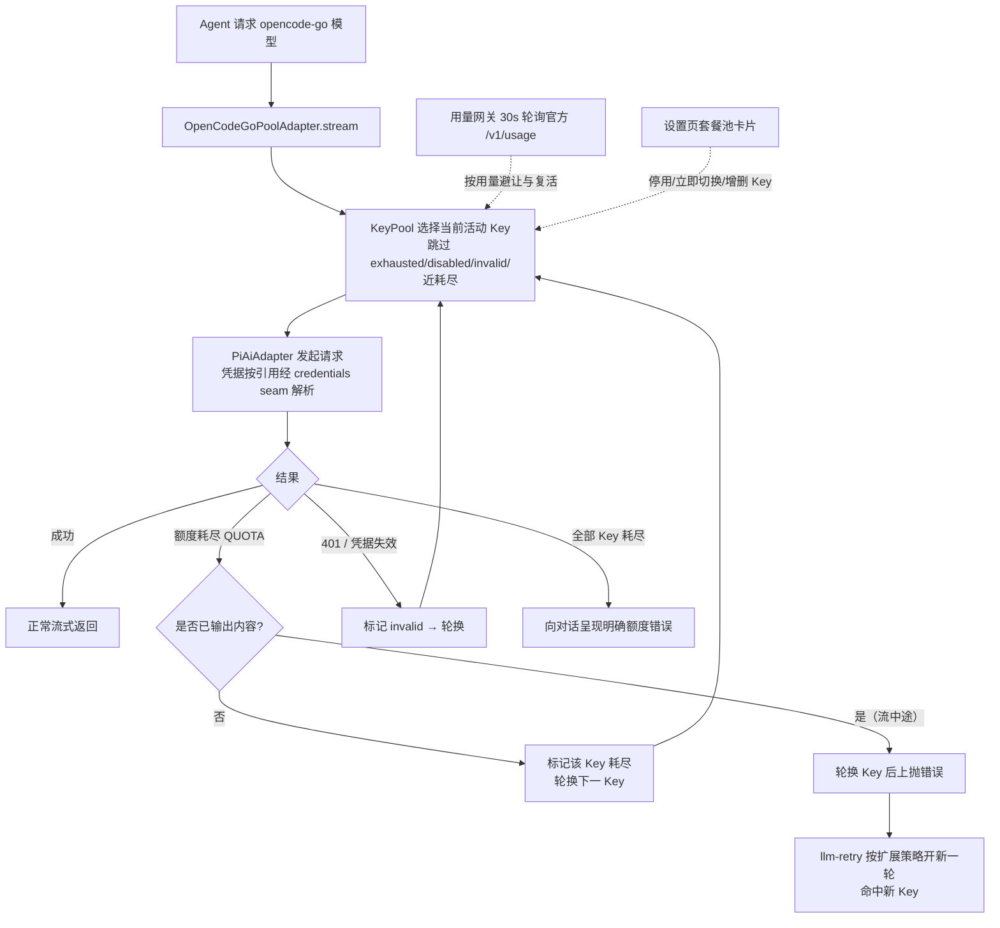

# dsh-opencode-go-pool

DeepSeek Harness（DSH）插件：**OpenCode Go 套餐的多 Key 池** —— 当前 Key 额度耗尽时**自动、无感地切换到下一个 Key**，并在设置页提供与官网一致的**套餐余额管理卡片**（5 小时滚动 / 每周 / 每月 已用·剩余·重置时间）。

- 每个 OpenCode Go 账号有独立的 5 小时滚动 + 每周 + 每月额度。DSH 官方供应商（`dsh-llm-pi-ai` 的 `opencode-go` 路由）每个供应商只能填一个 Key，额度耗尽后必须手动更换——本插件接管该路由，用 Key 池 + 自动故障切换解决。
- 余额数据来自 OpenCode 官方用量接口（与官网同源，见下文）。
- **运行环境**：DSH `0.2.1-alpha.2`（`peerDependencies` 写成 `^0.2.1-alpha.1` 系列：覆盖 0.2.1 的 prerelease 与稳定版，不含 0.3.0；0.1.x 的设置 seam 仍兼容，但新特性以 0.2.1 的 volatile 配置为准）。

## 功能

| 功能 | 说明 |
|---|---|
| 🔄 自动切换 Key | 请求因额度耗尽（`QUOTA`）失败时，在同一次流式调用内静默换下一个 Key 重发，对话零感知；凭据失效（401/`INVALID_CREDENTIAL`）同样自动跳过 |
| 📊 套餐管理卡片 | 设置侧边栏「OpenCode Go 套餐池」页：每个 Key 的 5h 滚动 / 每周 / 每月 已用%·剩余%·重置倒计时，与官网一致 |
| 🎛 运行态管理 | 卡片内：立即切换、停用/启用、清除失效、新增/删除 Key（写入插件命名空间，带版本栅栏，无需改 yml） |
| ♻️ 自动复活 | 额度耗尽的 Key 在其 5h 窗口重置后（用量接口报告恢复）自动回到池中 |
| 🧭 无缝接管 | 接管 `opencode-go` 路由：删除「设置 → 模型」中的 opencode-go 行后自动完成，历史会话与模型选择器完全不变 |
| 🗂 模型选择 | 卡片内勾选该路由暴露哪些模型：「全部模型」跟随官方目录；自定义时未勾选的模型不出现在聊天模型下拉、也无法发起请求；默认折叠，点「展开」查看 |
| 📥 拉取最新模型 | 卡片内「拉取模型」从官方 `models` 接口抓取供应商最新模型列表；目录里还没有的新模型即时进入可选列表（按默认协议接入，勾选即可尝试） |

## 安装

```sh
dsh plugin --profile web add github:whitelonng/dsh-opencode-go-pool
```

安装/升级插件本身需重启 DSH 一次。此后在卡片里增删 Key、改阈值、改模型选择都会**即时生效**：这些字段在 DSH 0.2.1 里是 volatile 配置，Loader 原地更新，不会重挂插件、也不打断进行中的会话。随后：

1. **迁移**：打开「设置 → 模型」，删除 `opencode-go` 供应商行（本插件会自动接管该路由；未删除时插件保持休眠并在卡片中显示引导）。
2. **配置 Key**：打开「设置 → OpenCode Go 套餐池」→「Key 管理」，为每个账号添加一行（id 自动生成；label 为显示名；凭据引用填环境变量名，如 `OPENCODE_GO_KEY_A`）。
3. **填写密钥**：把每个 Key 的明文写入凭据页（设置 → 模型 → 凭据，对应环境变量名），或 `~/.dsh/.credentials.yaml` / 环境变量。**明文 Key 永不进入插件配置、日志或任何 RPC 响应。**

### 手工安装（等价步骤）

`$DSH_HOME/profiles/web/cordis.patch.yml` 加入插件行：

```yaml
- id: opencode-go-pool
  name: 'dsh-opencode-go-pool'
  config:
    route: opencode-go          # 接管官方路由；冲突时休眠等待接管
    keys: []                    # 初始为空，由卡片管理（也可在此预置）
    preemptAtPercent: 100       # <100 时，5h 用量达到即主动避让（默认 100：失败才切）
    modelMode: all              # all=暴露全部官方模型；custom=仅暴露 models 列出的模型
    models: []                  # modelMode=custom 时的模型 id 列表（也可在卡片内勾选）
    usageBaseUrl: https://opencode.ai/zen/go/v1/usage
    usageRefreshMs: 30000
    timeoutMs: 15000
```

并在 profile 的 `package.json` 中声明依赖后重新安装依赖。

## 工作原理



- **静默切换发生在同一次 `stream()` 内**：额度错误在产出任何 token 前到达时，直接换 Key 重发，上层（agent loop）看到的是一次成功的流式回复。
- **流中途限额**（已吐 token 后 429）无法静默重试；此时先轮换 Key 再上抛，插件同时把 `QUOTA` 加入该路由的可重试码（预算 = Key 数），`dsh-llm-retry` 会自动开新一轮命中新 Key。
- **路由接管**：`opencode-go` 路由被 `dsh-llm-pi-ai` 持有时，插件休眠并监听 `llm/adapters-updated`，路由一释放即原子接管；老会话记录的路由 id 不变，历史对话无缝继续。
- **凭据**：配置只存凭据引用名（`apiKeyEnv`），明文走 DSH 凭据 seam，每次请求按引用解析；解析失败大声报 `MISSING_CREDENTIAL`，绝不回落到无关的环境变量 Key。
- **模型选择**：卡片勾选后写入 `modelMode`/`models`；适配器的 `listModels` 只返回勾选的模型（聊天模型下拉即时生效），`resolveModel`/`stream` 对未勾选模型返回明确的 `UNKNOWN_MODEL`。选择变化会重发 `llm/adapters-updated`，模型选择器无需重启即可刷新。
- **设置写入**：卡片经 Typert RPC 调 `putKeys`/`putConfig`，host 侧走 DSH 0.2.1 的 `ctx.settings.update(entryId, patch, revision)`（config-editor 支撑的 SettingsForms）；插件 Config 中卡片可编辑的字段声明为 `volatile`，Loader 原地更新并广播 `loader/volatile-update`，插件据此重算 KeyPool / 路由，插件实例不重挂。`route` 保持普通字段：改路由会重挂插件并重新注册适配器。
- **适配器画像与 auth**：接管模式直接向 `dsh-llm-pi-ai` 提供该路由的*已解析* profile（`piProvider`、`modelErrors`、`configuredMaxTokens`、图像预算等适配器自有字段）。这些字段平时由 llm-pi-ai 的 `Config` 解析产生，插件自建时必须齐备：`PiAiAdapter.modelOf()` 先读 `profile.modelErrors`，缺这个 Map 时每个模型的解析与流式请求都会抛 `Cannot read properties of undefined (reading 'get')`。0.2.1 还把适配器的 `auth`（`{credentials, authContext}`）从可选改为必填，插件提供 `createPiAiAuth()`：不写 pi-ai 凭据记录（Key 一律用 `apiKeyEnv` 引用），只把环境/API 引用解析交给 credentials seam。回归测试见 `test/profile.test.mjs` 与 `test/settings-forms.test.mjs`。
- **持久化**：运行态（活动 Key / 耗尽 / 失效 / 停用）原子写入 `$DSH_HOME/opencode-go-pool.state.json`，重启恢复。

## 用量接口

```http
GET https://opencode.ai/zen/go/v1/usage
Authorization: Bearer <OpenCode Go API Key>
```

返回三个窗口的 `percent`（0–100）与 `resetsAt`（ISO-8601）：

```json
{ "usage": { "rolling": {"status":"ok","percent":9, "resetsAt":"…"},
             "weekly":  {"status":"ok","percent":12,"resetsAt":"…"},
             "monthly": {"status":"ok","percent":6, "resetsAt":"…"} } }
```

该接口**未写入 OpenCode 公开文档**，解析做了防御式处理：形状变动只影响卡片显示（降级为错误提示），不影响自动切换功能；`usageBaseUrl` 可配置。

## 配置项

| 键 | 默认 | 含义 |
|---|---|---|
| `route` | `opencode-go` | 接管官方路由；改为 `opencode-go-pool` 时注册自有路由（与官方并存，模型选择器需手动切换一次） |
| `keys` | `[]` | Key 列表：`{id, label, apiKeyEnv}`；通常留空由卡片管理 |
| `preemptAtPercent` | `100` | 5h 滚动用量达到该百分比即主动避让；100 = 仅在失败时切换 |
| `modelMode` | `all` | `all`=暴露官方目录全部模型（新模型自动可用）；`custom`=仅暴露 `models` 勾选的模型 |
| `models` | `[]` | `modelMode=custom` 时的模型 id 列表；卡片内「模型选择」勾选后写入 |
| `usageBaseUrl` | `https://opencode.ai/zen/go/v1/usage` | 用量接口地址 |
| `modelsBaseUrl` | `https://opencode.ai/zen/go/v1/models` | 「拉取模型」接口地址 |
| `usageRefreshMs` | `30000` | 卡片轮询间隔（host 侧另有 15s TTL 缓存） |
| `timeoutMs` | `15000` | 用量请求超时 |

## 与其他插件的关系

- 本插件覆盖 [dsh-opencode-go-usage](https://github.com/xiaoqi20/dsh-opencode-go-usage) 的全部功能（多 Key 版），安装后可卸载后者。
- 与 `dsh-llm-pi-ai` 共存：接管模式下请删除其 `opencode-go` 行；pi-ai 的其他供应商不受影响。

## 开发

纯 ESM，零构建步骤：

- Host 半：`index.js`（插件 + 池适配器 + 接管）、`pool.js`（状态机）、`usage.js`（用量网关）、`models.js`（模型目录拉取）、`typert.host.js`（RPC 清单）
- 浏览器半：`client.js`（lazy-CJS bundle，`window.__ModuleLoader__.load` 格式）
- 测试：`node --test test/*.test.mjs`（76 项，依赖装齐后 0 跳过）：状态机 17（`pool`）、用量网关 7（`usage`）、模型目录 8（`models`）、cordis 烟测 12（`smoke`：路由接管、静默切换、0.2.1 forms seam、0.1.x register/configEditor 旧 seam）、真实服务集成 9（`integration`：真实 `LlmRuntime` 注册表 / `llm.stream` 全链路 / settings 写入契约 / 接管握手）、真实 SettingsForms 3（`settings-forms`）、适配器画像与 auth 3（`profile`）、导入与 Typert 清单 8（含宿主对等依赖对齐）、客户端 bundle 执行与渲染 9（`client`）。缺少 harness 依赖时相关测试优雅跳过。

```sh
node --test test/*.test.mjs
```

## 注意事项

- **多账号使用请自行确认符合 OpenCode 服务条款**；本插件只提供技术能力。
- 全池耗尽时对话会收到明确的额度错误，卡片会全红显示；5h 窗口重置后自动恢复。
- 每 Key 每次静默重试会重复计费输入 token（额度失败本身不计费），成本上限 = 池大小 × 单请求。

## 许可证

MIT

## 验证记录

**0.2.1-alpha.2 升级验证（2026-10-10）**：`node --test test/*.test.mjs` → 76 项全部通过、0 跳过，跑在 `0.2.1-alpha.2` 依赖上（`@deepseek-ai/cordis@4.0.5-alpha.1`、`schemastery@3.18.5-alpha.1`、`@earendil-works/pi-ai@1.1.0`）。本次 release 对本插件只有一处依赖变更：

- **pi-ai `^0.87.1` → `^1.0.2`**：alpha.2 的 `dsh-llm-pi-ai` 抬了大版本（宿主运行时副本为 1.0.2），而本插件把它声明为对等依赖。链接 checkout 时 profile 解析层会用宿主副本替换该位置，但预检只查 `@deepseek-ai/dsh*` 对等项、对等范围也不参与解析筛选，所以旧范围不会报错，只会让本地 dev 副本（0.87.1）与运行副本（1.0.2）分叉——测试测的不是宿主实际加载的那个大版本。现对齐为 `^1.0.2` 并新增回归测试固定这条不变式。
- alpha.2 的其余改动均未触及本插件契约：设置 seam（`SettingsForms` volatile / `settings.update|replace`）、客户端 `settings.section` slot 契约、Typert loader 校验规则都没变；`LlmRuntime.prepareCall(config, signal?, configure?)` 为追加参数；`LlmModelReasoningInfo.efforts` 只是把顺序约定写清楚（由小到大，本插件动态模型档位 `off/high/max` 已符合）。

**0.2.1-alpha.1 升级验证（2026-10-08）**：`node --test test/*.test.mjs` → 75 项全部通过、0 跳过，跑在 registry 安装的 `0.2.1-alpha.1` 依赖上（`@deepseek-ai/cordis@4.0.5-alpha.1`、`schemastery@3.18.5-alpha.1`、`@earendil-works/pi-ai@0.87.1`）。其中：

- `test/settings-forms.test.mjs` 用**真实** `@deepseek-ai/dsh-settings`（SettingsForms）核对：插件 `Config` 暴露为可编辑表单的字段恰为卡片可编辑的 5 个 volatile 字段，`route` 保持普通字段并被服务拒绝写入；`settings.update(entryId, patch, revision)` 的合并结果、revision 栅栏（`SETTINGS_CONFLICT`）都符合预期。
- `test/integration.test.mjs` 用**真实** `LlmRuntime` 与 `PiAiAdapter`：注册表 / `llm.stream` 全链路 / 接管握手。
- `test/profile.test.mjs` 用**真实** `PiAiAdapter` 校验手写 profile 与新增的 `auth` 注入。

**无 GUI 真实启动验证**（在有可用运行时的机器上执行；本仓库的开发沙箱里 `node-addon-require-builtin` 无法挂接该 Node 构建的 ESM loader，报 `Unsupported/no-getter`，故无法在此复现）：

```sh
DSH_HOME=/tmp/dsh-boot-test/home \
OPENCODE_GO_KEY_A=sk-test-placeholder-aaaa OPENCODE_GO_KEY_B=sk-test-placeholder-bbbb \
node $DSH_APP/node_modules/@deepseek-ai/dsh/lib/bin.js --profile test "ping"
```

预期输出（证明 agent 请求真实派发进池适配器并完成轮换）：

```
dsh: QUOTA: opencode-go-pool: every key is exhausted, disabled, or invalid …
```

状态文件同时记录：两个 Key 因真实 401（`AuthError: Invalid API key.`）被标记 `invalid`、依次轮换、`lastSwitch.reason: invalid`。真实凭据下额度耗尽（`QUOTA`）走完全相同的轮换机器。
